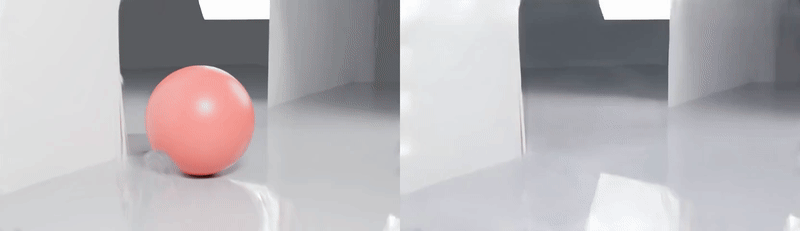

# Measuring and Removing an Object's Light Footprint

Reflection-aware object removal in 3D Gaussian Splatting via **render–edit–refit**:
delete an object from a 3DGS scene *together with* its shadow, mirror reflection
and colour bleed, using a removal-specialised video prior (ROSE) and a 4-click
SAM 2 mask protocol. Benchmarked on a synthetic Blender scene with exact clean
plates. Headline: footprint PSNR **14.2 → 28.4 dB** over plain deletion, with
edits surviving the lift to 3D (31.3 dB on held-out novel views). See
[`results.md`](results.md) for all numbers and `figures/` / `videos/` for
qualitative results.

Final project, *Deep Learning for 3D Computer Vision*, HUJI (instructor: Sagie Benaim).

*Left: original scene. Right: after removal — object, shadow, mirror image and floor
reflection gone together. Full-resolution videos in [`videos/`](videos/).*

## Repository layout

- `light-footprint-removal/renders/footprint_dataset/make_scene.py` — Blender/Cycles
  script that builds the benchmark scene and renders paired with/without-object
  orbits (81 frames, 832×480) + object masks + `transforms.json`.
- `light-footprint-removal/renders/footprint_dataset/extract_aux.py` — converts raw
  alpha masks to binary mask PNGs.
- `notebooks_clean/` — the five pipeline notebooks, in order:
  1. `phase2_train_3dgs.ipynb` — fit splatfacto (15k iters) on with-object renders; eval ceiling.
  2. `phase3_delete_and_measure.ipynb` — M1 baseline: mask-lifted Gaussian deletion + footprint-region scoring.
  3. `phase4_vace_edit_and_refit.ipynb` — VACE edits, mask protocols, re-fit + scoring for all methods.
  4. `phase4b_rose.ipynb` — ROSE edits (object / oracle masks).
  5. `phase5_sam2_rose.ipynb` — 4-click SAM 2 mask propagation + ROSE edit.
  6. `phase6_real_demo.ipynb` — qualitative real-capture demo on Mip-NeRF 360
     "garden" (fit → orbit → clicks → ROSE → refit → before/after video).
- `figures/`, `videos/`, `results.md` — collected results.

## Reproduce

Run the notebooks in the order above on Google Colab (T4/A100), with the dataset
folder at `MyDrive/light-footprint-removal/` (produced by `make_scene.py` +
`extract_aux.py` under Blender ≥4.0). Each notebook mounts Drive, installs its
own pinned dependencies in-cell, and persists outputs back to Drive;
`requirements.txt` lists the same core dependencies for reference.

## Code provenance

`make_scene.py`, `extract_aux.py` and all notebook code are written by the author
(with AI coding assistance; all results verified by the author). Third-party code
is used as unmodified libraries only: nerfstudio/splatfacto, diffusers (VACE),
the [ROSE](https://github.com/Kunbyte-AI/ROSE) repository and SAM 2 — cloned or
pip-installed in the notebooks, not vendored here.
