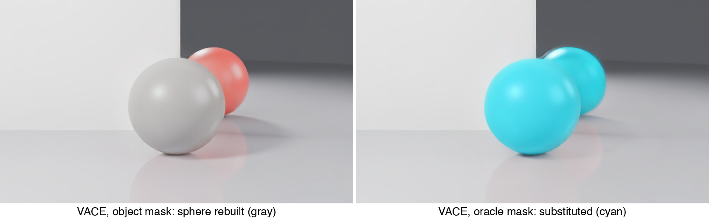
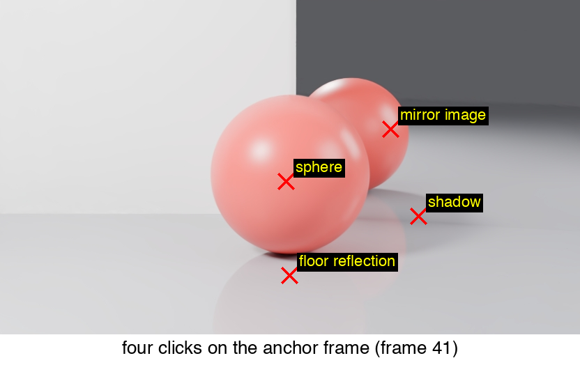

# Removing an Object's Light Footprint from a 3D Scene

Delete an object from a 3D Gaussian Splatting scene **together with its shadow,
mirror reflection, and colour bleed** — no inverse rendering, no model training,
no COLMAP. Render an orbit from the scene, let a removal-specialised video
diffusion prior (ROSE) edit it under masks propagated by SAM 2 from **four
clicks on a single frame**, and re-fit a fresh 3DGS on the result.

**Stack**: PyTorch · nerfstudio (3D Gaussian Splatting) · video diffusion
(Wan2.1-VACE, ROSE) · SAM 2 · Blender/Cycles · evaluated on a purpose-built
benchmark with pixel-exact ground truth.

*Left: original scene. Right: after removal — object, shadow, mirror image and
floor reflection gone together, measured on held-out novel views.*

## Results

Evaluated against **pixel-exact clean plates**: the benchmark scene is rendered
twice along the same 81-camera arc, with and without the object, so ground
truth for "what should removal produce" exists exactly. PSNR (dB) on held-out
novel views, after re-fitting a fresh 3DGS on the edited frames:

| Method                          | PSNR full | PSNR footprint |
|---------------------------------|-----------|----------------|
| Reconstruction ceiling          | 45.7      | —              |
| Gaussian deletion               | 23.1      | 14.2           |
| VACE, object mask               | 21.6      | 14.2           |
| VACE, oracle mask               | 18.2      | 13.1           |
| ROSE, object mask               | 23.2      | 15.0           |
| ROSE, oracle mask               | 31.1      | 28.4           |
| **ROSE, SAM 2 masks (4 clicks)**| **31.3**  | **28.4**       |

Two findings worth the read:

- **Generalist video editors substitute, they don't remove.** Asked to delete a
  sphere given only its silhouette mask, VACE rebuilt the sphere *from its own
  shadow and reflections* (left); given the full footprint mask, it invented a
  cyan sphere — with a physically consistent cyan mirror image (right). The
  footprint encodes the object.

  

- **Four clicks match an oracle.** SAM 2 propagates one click each on the
  object, its mirror image, its shadow, and its floor reflection across all 81
  frames — and ties ground-truth footprint localization (31.3 vs 31.1 dB).

  

Full numbers and per-experiment notes: [results.md](results.md). Full write-up:
[report.pdf](report.pdf). Videos (orbits, masks, side-by-sides): [videos/](videos/).

## Real-capture demo

The same recipe on a real scene — Mip-NeRF 360 *garden*: four clicks (vase,
metal disc, dried flowers), SAM 2 propagation, ROSE edit, then a refit that
keeps the original render outside the mask and is seeded with the source
model's own points. Vase, disc, flowers, contact shadow and tabletop
reflection removed together; no clean plates exist for a real scene, so this
one is qualitative.

## How it works

1. **Reconstruct** — fit `splatfacto` (3DGS) to the scene images.
2. **Render an orbit** — 81 frames at 832×480 with exactly known poses.
3. **Edit** — ROSE (or VACE, as the ablation) edits the orbit under a binary
   mask video; masks come from 4 clicks + SAM 2.1 propagation.
4. **Re-fit** — train a fresh 3DGS on the edited frames, unchanged poses.
   All metrics are computed on this re-fitted model's held-out views, so the
   numbers measure what survives the lift back to 3D.

## Repository layout

- `light-footprint-removal/renders/footprint_dataset/make_scene.py` —
  Blender/Cycles benchmark generator: paired with/without orbits, object masks,
  `transforms.json` (plus `extract_aux.py`, `fix_masks.py` helpers).
- `notebooks_clean/` — the pipeline as six Colab notebooks, in run order:
  | # | notebook | stage |
  |---|----------|-------|
  | 2 | `phase2_train_3dgs` | fit splatfacto, reconstruction ceiling |
  | 3 | `phase3_delete_and_measure` | deletion baseline + footprint scoring |
  | 4 | `phase4_vace_edit_and_refit` | VACE edits, mask protocols, all re-fits + scores |
  | 4b | `phase4b_rose` | ROSE edits (object / oracle masks) |
  | 5 | `phase5_sam2_rose` | 4-click SAM 2 protocol + ROSE |
  | 6 | `phase6_real_demo` | qualitative real-capture demo (Mip-NeRF 360 garden) |
- `figures/`, `videos/`, `results.md`, `report.pdf` — results and write-up.
- `docs/` — the original project proposal.

## Reproduce

Generate the dataset with Blender ≥ 4.0 (`blender -b -P make_scene.py`, then
`python extract_aux.py <out>/with`), put it in Google Drive under
`MyDrive/light-footprint-removal/`, and run the notebooks in order on Colab
(T4 works; A100 recommended). Each notebook mounts Drive, installs its own
pinned dependencies, and writes its outputs back to Drive. `requirements.txt`
mirrors the pins for reference.

## Credits

Scene generator, Gaussian selection/deletion, mask construction, scoring, and
all orchestration are by the author. Third-party components used unmodified:
[nerfstudio](https://docs.nerf.studio) (splatfacto),
[VACE](https://github.com/ali-vilab/VACE) via diffusers,
[ROSE](https://github.com/Kunbyte-AI/ROSE), and
[SAM 2](https://github.com/facebookresearch/sam2).
Benchmark inspired by the paired-evaluation philosophy of SPIn-NeRF and
Remove360. Originated as a research project in *Deep Learning for 3D Computer
Vision* at HUJI. AI coding assistance (Claude) was used for development and
debugging; all results were produced and verified by the author. MIT licensed.
